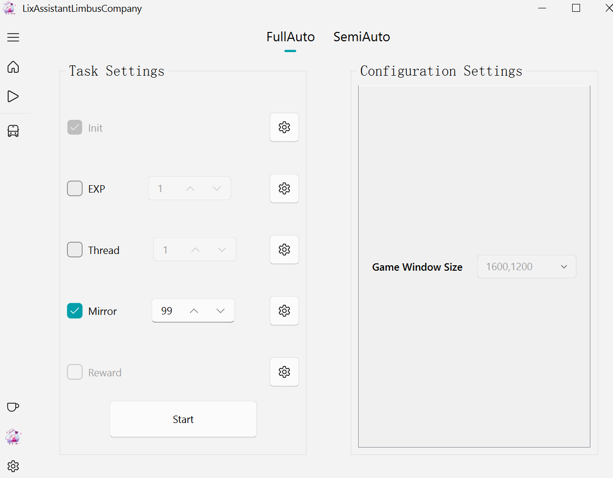
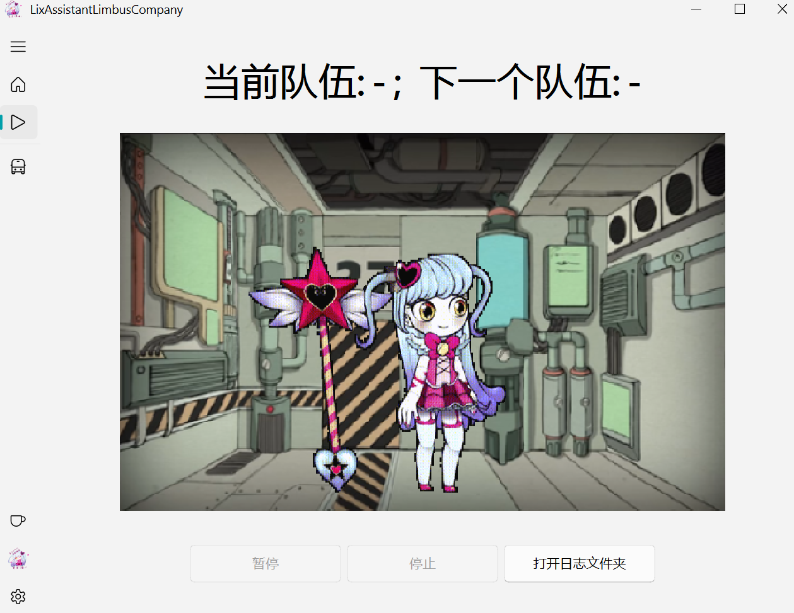
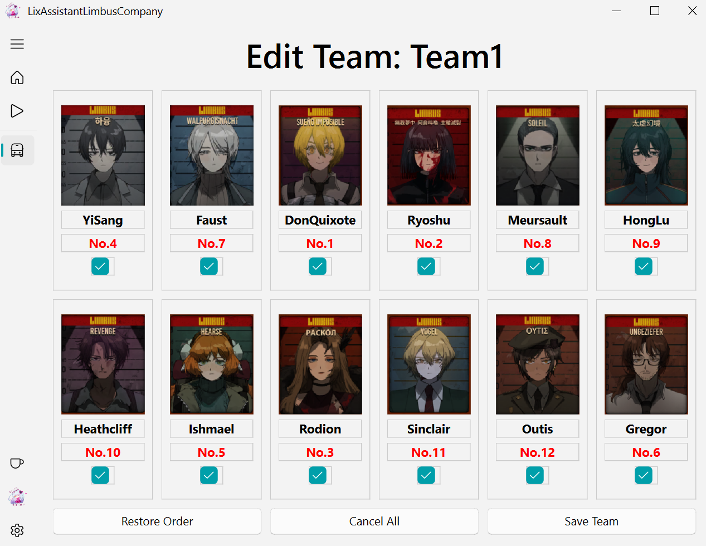
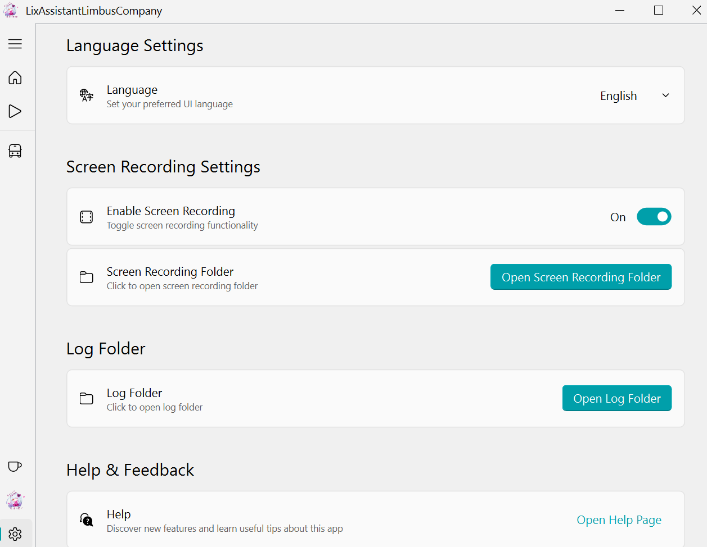

 

# LixAssistantLimbusCompany

 

    

    

    
    
    

    
    
    

**简体中文** | [English](README_en.md)
          
 

LALC 是 LixAssistantLimbusCompany 各取大写字母的缩写

是月计次世代 ~~大嘘~~ 手游(Steam?) LimbusCompany 的助手

GitHub现存**维护时间最长**的 Limbus 长草项目（之一）

历史**悠久**（2023.07.10-?）

从思想上，拜师 [MaaFramework](https://github.com/MaaXYZ/MaaFramework)，算 Maa 的不记名弟子吧

~~看项目星星数与本人心情~~ 飞速（？）更新中

- [LixAssistantLimbusCompany](#lixassistantlimbuscompany)
  - [实用功能和亮点](#实用功能和亮点)
  - [下载方式](#下载方式)
  - [使用说明](#使用说明)
  - [声明](#声明)
  - [图示样例](#图示样例)
  - [视频教程](#视频教程)
  - [加入开发](#加入开发)
  - [致谢](#致谢)
  - [友链](#友链)
  - [打赏](#打赏)
  - [最后](#最后)

---
## 实用功能和亮点

- 支持**半自动**辅助刷取**镜牢** Mirror
- 支持**全自动**刷取 **经验本** EXP，**纽本** Thread， **镜牢** Mirror
- 支持**队伍轮换**与队伍**流派选择**
- 支持在**脑啡肽**过多时，自动转换
- 自带**录屏**和**日志**记录
- 支持**自定义任务**，具体可查看[指导说明](./doc/json_guide_cn.md)
- 支持**自定义主题卡包选择**，编辑 `config` 中的 theme_pack.json 即可
- ~~确实没啥功能~~
- **解压即用**，不用辛苦配置环境
- 所见即所得，lim（x->∞）零成本入门使用 

---
## 下载方式

- 点击 [最新版本](https://github.com/HSLix/LixAssistantLimbusCompany/releases/latest) 并下载最新版中叫 LALC.zip 的，解压后运行 `LixAssistantLimbusCompany.exe` 即可。

- 如果是第一次安装电脑软件，可以看看 [堂吉诃德都能学会的安装指引](./doc/download_guide_cn.md)

---
## 使用说明

- 如果是第一次使用LALC，推荐查看一下 使用说明（[中文版](./doc/manual_cn.md) | [EnglishVersion](./doc/manual_en.md)）(How to use) 来了解基本使用方式。

- 如果发现问题，可以先看看 常见问题（[中文版](./doc/FAQ_cn.md) | [EnglishVersion](./doc/FAQ_en.md)）(FAQ)，再看看 [Issue](https://github.com/HSLix/LixAssistantLimbusCompany/issues) 中有无类似问题反馈，然后可以在 [Discussions](https://github.com/HSLix/LixAssistantLimbusCompany/discussions) 讨论 ，也欢迎通过
[Issue](https://github.com/HSLix/LixAssistantLimbusCompany/issues) 反馈。
- 如果对 LALC 的结构感兴趣，想参与开发或者做二次开发，可以查看 [开发文档](./doc/what_is_lalc_cn.md)。
- 如果有想法与精力，有意参与到 LALC 的开发中，成为一名光荣的贡献者，当然也欢迎提交 [PR](https://github.com/HSLix/LixAssistantLimbusCompany/pulls)。
- 如果你对作者的开发动态或其他方面感兴趣，可以到 [作者动态](https://space.bilibili.com/384632772/dynamic) 看看更新预告什么的。

---

## 声明

- 本软件开源、免费，仅供学习交流使用。

- 若您遇到商家使用本软件进行代练并收费，可能是设备与时间等费用，产生的问题及后果与本软件无关。

- 获取管理员权限是为了确保运行顺利

- 该版本离线，只能到 Github 自助更新

- 软件图标素材来源网图，不属于 GPL 协议开源的内容，如有侵权，请及时联系作者删除

---

## 图示样例
| 简体中文 | English |
| - | - |
|  |  |
|  |  |
|  |  |
|  |  |
|  |  |
---
## 视频教程

| 平台 | Bilibili | Youtube |
| - | - | - |
| 技术分享 |  |  |
| 操作演示 |  |  |
| Version 2.1.1-2.1.13 |  |  |

---

## 加入开发

LALC的开发欢迎所有开发者加入，可参考 [该文章](https://github.com/HSLix/LixAssistantLimbusCompany/issues/75) 开始，也可参考这个专门面向开发者的 [WikiPage](https://github.com/HSLix/LixAssistantLimbusCompany/wiki/%E5%BC%80%E5%8F%91%E6%89%8B%E5%86%8C)。

---
## 致谢

### 统一致谢
直接或间接参与到本软件开发的所有人员

包括在网络上分享各种教程的大佬们

还有开源自己代码的巨佬们！

### 本项目主要使用的库
| 库名 | 内容 |
| - | - |
| [opencv-python](https://github.com/opencv/opencv-python) | 开源图像相关算法库，尽管 LALC 只是使用其中一点功能，但这一点功能构成了整个项目的基础——识图 |
| [pynput](https://github.com/moses-palmer/pynput) | 开源的鼠标和键盘相关库，模拟鼠标点击和键盘输入 |
| [python-mss](https://github.com/BoboTiG/python-mss) | 开源的截屏库，截图又好又快 |
| [pyqt](https://pypi.org/project/PyQt5/) | 经典的跨平台 GUI 库，老牌劲旅，不用多说，要是体积能小点就更好了 |
| [qt-fluent-widgets](https://github.com/zhiyiYo/PyQt-Fluent-Widgets) | qt的第三方组件，用过的人都说好看，LALC 使用其中免费的组件，也遵循了 GPL 协议发布 |
| [pyinstaller](https://pypi.org/project/pyinstaller/) | 经典的打包库，尽管打出的包很大，但使用方便 |
| …… | …… |

### 打赏者
| 打赏者 | 打赏时间 | 留言 | 
| - | - | - |
| 世有万象 | 2023-11-20 | 6 |
| 灵清__ | 2023-11-24 | 加油！ |
| 灵清__ | 2023-11-24 | 无 |
| **锋 | 2024-10-12 | 无 | 
| * | 2025-04-05 | 大佬加油！ |
| [Celly](https://github.com/Ceres233) | 2025-04-05 | 我这人话不多 |
| **语 | 2025-04-13 | 无 |

### 贡献者

<!-- readme: collaborators,contributors -start -->
<table>
<tr>
    <td align="center">
        <a href="https://github.com/HSLix">
            
             
            <b>LuYaoQi</b>
        </a>
    </td>
    <td align="center">
        <a href="https://github.com/ZengXiaoPi">
            
             
            <b>曾小皮-ZengXiaoPi</b>
        </a>
    </td>
    <td align="center">
        <a href="https://github.com/pasathornpGStudio">
            
             
            <b>PasathornpGStudio</b>
        </a>
    </td>
    <td align="center">
        <a href="https://github.com/PasathornP">
            
             
            <b>PasathornP</b>
        </a>
    </td>
    <td align="center">
        <a href="https://github.com/1353587086">
            
             
            <b>1353587086</b>
        </a>
    </td>
    <td align="center">
        <a href="https://github.com/liuaj22">
            
             
            <b>Liuaj22</b>
        </a>
    </td></tr>
</table>
<!-- readme: collaborators,contributors -end -->

---

## 友链

除我以外，还有其它开发者也致力于 limbus 脚本的开发，可以的话，也希望大家多多支持！！

虽然有项目没有放我的链接，但我还是放了他们的，QWQ。特别“表扬”LCAA，连我应援的评论都删了，亏我还发动态支持LCAA的视频，QWQ

| 项目名称 | 简介  | 功能特点   | 支持平台       | 链接  |
| - | - | - | - | - |
| **AhabAssistantLimbusCompany** | 也是 PC 端全自动挂机脚本 | 更新勤快，镜牢自动化也做的不错，请大家多多支持。 | PC (Steam) | [GitHub](https://github.com/KIYI671/AhabAssistantLimbusCompany)
| **MAALimbusCompany**         | 基于 MAA 框架的安卓模拟器自动化工具，解放双手长草。 | 自动收菜、镜牢自动化、多语言支持（推荐英文）、高分辨率适配。              | Android/模拟器 | [GitHub](https://github.com/hxdnshx/MAALimbusCompany)                |
| **Limbus-Scripts**           | PC 端全自动挂机脚本。                                       | 支持日/韩/英三语、自定义 Ego 使用、队友死亡重开、桌宠模式。              | PC（Steam）    | [GitHub](https://github.com/Xie-Tiao/Limbus-Scripts)                |
| **LimbusCompute**            | 基于 Nuxt 的网页工具盒，提供游戏相关计算与攻略。                       | 支持 SEO 优化、多语言部署、持续集成（Cloudflare/GitHub Pages）。          | Web            | [GitHub](https://github.com/MusicOnline/LimbusCompute)               |
| **AutoLuxcavation-Limbus-Company** | Steam 版自动刷资源 Mod，适配任意分辨率。                             | 支持自动经验/纺锤本、日常任务完成、多分辨率兼容。                         | PC（Steam）    | [GitHub](https://github.com/LoGundes/AutoLuxcavation-Limbus-Company) |
| **limbus-company-auto**      | PC 端自动化脚本。                                     | 基于图像识别的战斗自动化、自定义 Ego 配置。                               | PC（Steam）    | [GitHub](https://github.com/Janrilw/limbus-company-auto)             |

---
## 打赏

- 如果您有打赏的想法，请尽量看完下面的说明

1. 首先，LALC 的下载与使用完全免费，所以不必付费；

2. 其次，金钱来之不易，而且作者并不急需打赏，作者更希望看到您能帮忙给本项目点个 Star，这对本项目已经是大力支持了！！！

3. 最后，这笔钱您还能有很多其他用处，买个香喷喷的大肉包犒劳自己的胃，买朵鲜花献于自己心爱之人，或者买下84本赛季通行证也不错；

- 如果您仍有打赏的想法，那我再拒绝就不礼貌啦o(￣┰￣*)ゞ（蠢蠢欲动地伸手

| 方式 | 二维码 |
| - | - |
| 微信 |  |
| 爱发电 |  |
| 支付宝 |  |

## 最后

- 如果你觉得该软件对你有帮助，请帮忙点个 Star 吧，这个网页右上角小星星对我们是最好的支持！

- 同时也希望有大佬把这个依托答辩的代码进行狠狠地优化

- 陆爻齐就是看不惯有些收费的脚本或者封闭自萌的脚本，自己就要做一个免费、开源的，最好能有大神加入开发继续发扬。

- ~~但真实制作动机是作者因潜水过久~~

- ~~被全自动镜本脚本测试群踢出来后进群失败~~

- 希望这个软件能帮助大家减少 limbus 游玩过程中反复乏味的部分，享受里面精彩的表演，有趣的机制就够了，游戏就是要笑着玩的嘛(:

---
## Star History

~~悄悄更个图，应该没人发现吧~~

