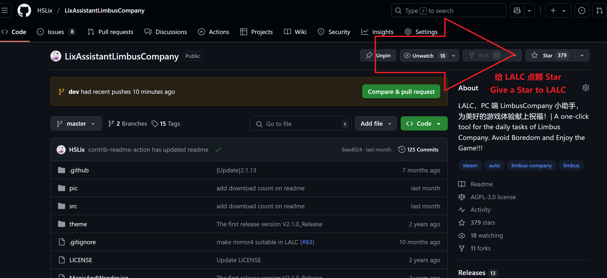

# 下载步骤（堂吉诃德都能学会）| Download Guide
1. 下载 LALC.zip 并解压 | Download LALC.zip and extract it.

2. 打开文件夹 | Open the folder

3. 运行 LALC | Run the exe

4. 回到[主页](https://github.com/HSLix/LixAssistantLimbusCompany)给 Limbus 点 Star ：） | Click [LALC](https://github.com/HSLix/LixAssistantLimbusCompany) and Send a star to lalc ：）

